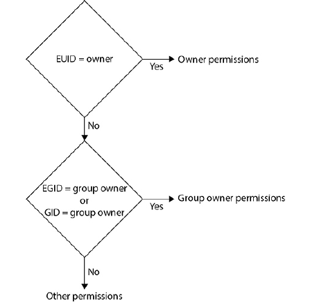
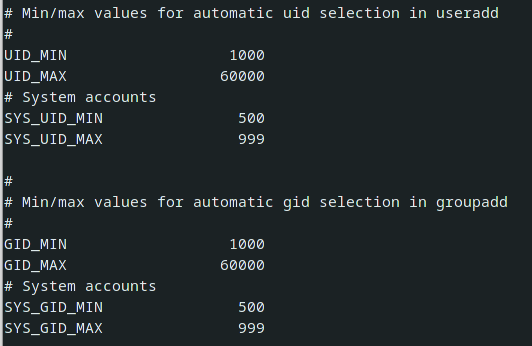

##  Linux Operating System Structure

* **Hardware layer** Responsible for interacting with system hardware.
* **Kernel** The kernel layer is the core of the operating system. It
  provides the system with process, memory, and task management.
  The kernel also connects applications to system hardware. The
  kernel is divided into the following components:
  * **System Call Interface** The System Call Interface (SCI)
    provides a connection between user space and kernel space.
  * **Process management** Responsible for creating, stopping, and
    communicating with system processes.
  * **Memory management** Responsible for memory allocation,
    virtual memory, and paging.
  * **Virtual File System** Provides an abstraction layer for multiple
    filesystem types.
  * **Network stack** Provides protocols used in network
    communications.
  * **Device drivers** Software used to communicate with hardware.
  * **Architecture-dependent code** System code specific to the type
    of processor.

* **Shell** Application and user environment and interface.

* **Operating system software** Used to manage the operating system.

* **Application software** Editors and other user applications.

  

**Kernel**

The kernel layer is the core of the operating system. Most Linux
distributions use a monolithic kernel. Some (GNU) use a microkernel.
To understand the difference between a *monolithic and microkernel*, you
must understand the terms *user space and kernel space*. Kernel processes
execute in memory reserved for kernel processes (kernel space). User
processes execute in memory reserved for user applications (user space).
Separating user and kernel space protects kernel processes.

* **Monolithic Kernel**
  A monolithic kernel executes in kernel space. Monolithic kernels are made
  up of modules that perform specific functions. These modules may be
  dynamically loaded or unloaded.
* **Microkernel**
  A microkernel uses a small kernel executing in kernel space to manage
  memory, multitasking, and interprocess communication. Most other kernel
  functions are built in to “servers” that execute in user space.

## Using the vi Text Editor

`vi <filename> Or vim <filename>`

**vi uses five different operating modes ** 

- Command mode

  Pressing the ESC key once places you in command mode. The command
  mode allows you to issue local editing commands. Local commands would
  be used to add or modify a character, word, single line, or multiple lines.

- Command-line mode

  Pressing ESC : places you in command-line mode. Commands issued in
  command-line mode are global commands; they affect the entire document.
  Examples of global commands are write, search, and search and replace.

- Insert

  Insert mode inserts text to the left of the cursor. ESC i (lowercase i) inserts
  text immediately to the left of the cursor, and ESC I (uppercase I) inserts text
  at the left margin.

- Append

  Append mode adds text to the right of the cursor. ESC a (lowercase a)
  appends text immediately after the cursor, and ESC A (uppercase A) appends
  text at the end of the current line.

- Open

  The open mode is used to open a line above or below the current cursor
  position and places the editor in insert mode and the cursor at the left
  margin. ESC o (lowercase o) opens a line below the current cursor position,
  and ESC O (uppercase O) opens a line above the current cursor position.

**Shortcuts**

| Command          | Action                                                       |
| :--------------: | ------------------------------------------------------------ |
| ESC-dw           | Deletes the word that comes immediately after the cursor, including the space following the word. |
| ESC-d$           | Deletes from the insertion point to the end of the line.     |
| ESC-dd           | Deletes the entire current line.                             |
| ESC-p            | Inserts deleted text before or below the current cursor location. |
| ESC-P            | Inserts deleted text after or above the current cursor location. |
| ESC-u            | Undoes the last action. |
| ESC-U            | Undoes all changes made on the current line. |
| ESC-D            | Deletes the rest of the current line from the cursor position. |
| ESC-yy           | Copies the line in which the cursor is located to the buffer. |
| ESC-a            | Appends after cursor. |
| ESC-A            | Appends after line. |
| ESC-C            | Changes to the end of the line. |
| ESC-cc           | Changes the whole line. |
| ESC-ZZ           | Saves the current file and ends vi. |
| ESC-h            | Moves the cursor left one character. |
| ESC-j            | Moves the cursor down one line. |
| ESC-k            | Moves the cursor up one line. |
| ESC-l            | Moves the cursor right one character. |
| ESC-0            | Moves the cursor to the start of the current line. |
| ESC-:w           | Writes the current file to disk. |
| ESC-:exit        | Writes the current file to disk and then closes vi. |
| ESC-:wq          | Also writes the current file to disk and closes vi. |
| ESC -:q          | Closes vi without saving the current file. |
| ESC-:q!          | Closes vi without saving the current file, even if the file has been modified. |
| ESC-:w!          | Overwrites the current file. |
| ESC-:e!          | Forgets changes since the last write. |
| CTRL-G           | displays a status line at the bottom of the interface. |
| /search [string] | searches from the current cursor position to the bottom of the document for the specified string. |
| ?search [string] | searches from the current cursor position to the top of the document for the specified string. |

From within command mode, you can enter a colon (:) to switch to command-line mode.

## Working with the Linux Shell

**# Shell** is a program that functions as a user interface, command-line interpreter, and programing (scripting) language. Let’s take a brief look at each of these entities.

Linux provides two types of user interfaces : CLI & GUI

**# Configuring the Shell**

The shell configuration files set up the user environment (/etc/profile and ~/.bash_profile) and regulate how the shell operates (/etc/bashrc and ~/.bashrc).

* **process** is single instance of a program that operates in its own memory space. The operating system assigns a unique process ID (PID) each time a program is started. This PID is used to control and track resources assigned to the program.

* **Parent and Child Processes** When you log on a system, you are presented with a default login shell.
  This shell is a program (by default, bash) that allows you to execute additional programs. 

  When you execute a command such as ls, a sub-shell or child process is created. This means that a copy of the current process (parent) is created and a new instruction set is loaded into the new process (child) Once the command has executed, the child is killed and control reverts to the parent.

* **Variables** A variable is a memory location that is assigned a name and is used to store data. Variables are used to configure operating environments or to temporarily store program data. When a user logs off or the system is turned off, data stored in these memory locations are lost.

  * **Local Variables** A local variable only exists in the memory space of the shell in which it is created. This means if you create a variable in a parent process and then create a child process, the variable created in the parent will not be present in the child.

    The syntax for creating a local variable is `[variable_name]=[value]`.

    To view the contents of a variable, execute the command `echo $[variable_name]`.

    The `set` command will display a list of all the variables and functions that exist in the current process.

  * **Environmental or Global Variables** In order to copy a shell variable from the parent process to the child process, you need to assign an export attribute to the variable. When a parent spawns a child process, all variables with this attribute are copied to the child

    An environmental (or global) variable is any variable assigned an export attribute. To create a variable and assign an export attribute, execute the command `export [variable_name]=[value]`

    The command `env` will display a list of all environmental variables in the current shell. To determine if a specific variable has an export attribute, 

    execute the command `env | grep [variable_name]`.

* **Aliases**  is a command shortcut  

  set alias `alias [alias_name]='[command]'`

  unset alias `unalias [alias_name]='[command]'`

  *note : on logout aliases which define by above way are deleted to make alias permanent you must add it to `~/.bachrc`*

  

**# Bash Configuration Files**

`/etc/profile` & `/etc/bashrc `  system (global) configuration files that are applied to all applicable users.

`~/.bash_profile` & `~/.bashrc` & `~/.bash.logout` Files located in the user’s home directory (~/<user_name>) contain user-specific configuration information. Settings in these files override the `/etc` configuration file settings.

* **`/etc/profile`**

  The file `/etc/profile` is a generic file only read when a user logs on to the system or executes a command that forces a logon (such as su -).
  When a login shell is run, the bash shell program searches for configuration files in the following order:
  `~/.bash_profile || ~/.bash_login || ~/.profile`

  Once one of those configuration files is found the remaining files are ignored. This file is used to set up the environment for any user whose default shell is either the bourne, korn, or bash shell. The file /etc/profile is read when a user logs on.

  *In /etc/profile you will find the following:*
  **HOSTNAME** variable is set to the system’s
  **HISTCONTROL** History environmental variable that determines if bash will store command lines that begin with spaces or are duplicates.
  **HISTSIZE** History environmental variable that shows the number of commands stored by the history facility in memory.
  **umask** The value of umask determines what permissions will be denied when a file is created.

* **`/etc/bashrc`**

  contains commands that affect how the bash shell runs for all users whose default shell is bash. This file is read when called by a command found in ~/.bashrc. This configuration file contains system-
  wide configuration elements such as Aliases, Functions, Shell configuration options and PS1 prompt configuration

  *The letters rc stand for “run command.” rc (run command) files contain startup configuration information that determines how an application will operate.* 

* **`~/.bash_profile`**
  read after the file /etc/profile only when the user logs on to the system and if a user’s default shell is bash. The file .bash_profile is used to *customize the bash environment* for a user. The file
  contains variables used to configure the user’s working environment (such as time zone, locale, and editor).

* **`~/.bashrc`**
  The file ~/.bashrc is found in the user’s home directory and is used to customize how the bash shell runs. The ~/.bashrc file contains aliases, functions or shell parameters. ~/.bashrc is executed each time a process is started. This file would contain user specific: Aliases, Functions, Shell configuration options and PS1 prompt configuration

* **`/etc/profile.d`**
  The files in the directory /etc/profile.d contain configuration information for specific programs and are read automatically during the login process. The file /etc/profile (for bourne, korn, and bash users) contains a statement that reads all the files in /etc/profile.d with a suffix of .sh (for example, vim.sh). The file csh.login (for C shell users) contains a statement that reads all the files in /etc/profile.d with the suffix .csh (for example, vim.csh).

**The source Command** Configuration changes are not active until they are stored in memory. To
place changes in memory, you must execute the commands in the configuration file. 

The command `source [filename]` or  `[filename]` will execute the commands in a configuration file.
The file ~/.bash_profile is only read when the user logs on. Changes to a user’s .bash_profile would not be read until the user’s next logon. The source command source ~/.bash_profile or . ~/.bash_profile would make those configuration changes available immediately.

## Managing Linux Users and Groups

Linux uses a method called Discretionary Access Control (DAC) to permit or restrict access to an object (resource) based on the user and group identities associated with the user accessing the resource and the
permissions granted to that user ID or group ID by the resource.

**# Understanding Linux Users and Groups**

A user is a person or service that requires access to system resources. A user account is a method of providing or restricting access to system resources.

- **User IDs** Linux implements user ID ranges to organize users.

  - **User IDs 0–99** Administrative users 0–99 are added to the operating system during the installation process

  - **root** The user root is a privileged Linux account. Privileged accounts are granted greater access and management capabilities over nonprivileged user accounts. The user root has access to all files and commands and full control of the operating system, including the ability to bypass the operating
    system or application restrictions. Any user assigned the user ID 0 has root privileges.

  - **System Account** System accounts are nonprivileged accounts created by a system administrator or application and assigned user IDs within the range specified by the variables SYS_UID_MIN and SYS_UID_MAX in /etc/login.defs.

    *System accounts may be assigned to applications or services and are sometimes used to restrict access to configuration or data files. System accounts are not able to log on to the system, do not require a password, do not have password aging applied, and do not have home directories.*

    A system account is created by executing the command `useradd -r [user_name]`. The command will automatically assign the new account a user ID in the range specified by SYS_UID_MIN and SYS_UID_MAX. It will also make the appropriate password and password aging entries in
    /etc/shadow.

  - **User Account** A user account provides nonprivileged access to system resources. User account ID ranges are specified by the variables UID_MIN and UID_MAX in /etc/login.defs.
    A Linux service (an application that is running in the background, such as abrt) may be assigned a user account. The user account ID for a service will be in the range 0–99 or between the values set by SYS_UID_MIN and SYS_UID_MAX in /etc/login.defs.

**# Where Linux User Account Information Is Stored**

- **/etc/passwd** Contains user account in form a flat file database. Each line of the file contains a unique user record. Each record contains seven fields. A colon (:) is used as a delimiter (data boundary) to separate the fields.

  `username:Password:UID:GID:commment:home_directory:default_shell`

  - **User Name** The username is a unique word used to identify a user who has access to the system. The username is supplied by the administrator creating the account.
  - **Password** When UNIX was first developed, the user’s password was stored in this field. Unfortunately the /etc/passwd file’s permissions allowed everyone to read the file, so it was easy to
    hijack a user’s password. Passwords are now stored in the file /etc/shadow. When shadow passwords are not implemented, passwords are stored in /etc/passwd.
  - **UID** The Linux kernel identifies a user by their user ID, not their username. A user ID is a numerical identifier assigned each user and mapped to their username. Each user ID should be unique. However, although it is not a secure practice, you can map multiple usernames
    to the same user ID.
  - **GID** The gid field contains the group ID number of the user’s primary group. When a user creates a file, their primary group ID is assigned as the file’s group owner.
  - **Comment** By default, this field contains the user’s full name. You may change the information that appears in this field when adding or modifying the user account.
  - **Home_Directory** This field contains the absolute path to the user’s home directory.
  - **Default_Shell** Some accounts (system accounts) do not require a login shell. You will find these accounts have either /sbin/nologin or /bin/false in this field. Both prevent login. /bin/false immediately exits the login process. /sbin/nologin will display the message found
    in /etc/nologin and exit the login process.

- **/etc/shadow** Contains user password and password aging information

  Shadow utilities were implemented to fix security issues. In order to accommodate the new shadow utilities, the files /etc/shadow and /etc/gshadow were added, along with the commands gpasswd, pwconv, pwunconv, pwck, and grpck. 

  The /etc/shadow file is a flat file database which stores user password and password aging information. Each record in /etc/passwd should have a corresponding record in /etc/shadow. The format for a record in this file is as follows:

  `Username:Password:last_modified:min_day:max_day:days_warn:disabled_day:expire	`

  	- **Username** This is the user’s login name.

  - **Password** This field stores the user’s password in encrypted format.

    - If the account is a user account and this field only contains two exclamation points ( !! ), an account *password has never been assigned.*

    - password start with `$6$` The characters between the first two dollar signs (6 in this example) indicate the *encryption algorithm* used to create the password. The default algorithm is assigned in /etc/login.defs.

    - To prevent a user from logging on, you can *lock the account* using the commands

       `passwd -l [user_name]` or `usermod -L [user_name]`. If the account has been locked by the command passwd -l, the password field will be prefaced by double exclamation marks ( !! )

      If the password has been locked using the command `usermod -L`, the password field will be
      prefaced by a single exclamation mark (!<encrypted_password>). You may also see this if the account has expired.

    - If a user account has an asterisk (*) in the password field, *the account is disabled* (Figure 4-3). An account is automatically disabled if it has been x amount of days after the password expired. The default number of days is specified by the variable INACTIVE in /etc/default/useradd. The inactive days for a specific user may be set using the command `passwd -i [number_of_days]` or `chage -I [number_of_days]`. If a user account is disabled, you must remove the asterisk from the password field in /etc/shadow. User accounts in the ID range 1–99 that do not require a password will display an asterisk in this field.

    - You can force a user to change their password when they log on next by expiring the account using the command `passwd -e [username]` or setting the last change date to 0 using the command `chage -d 0 [username]`.

  - **last_modified** This field displays the number of days since January 1, 1970, that the password was last changed. This number is used to calculate password aging dates.
    To change the last modified date for a user, execute the following command:
    `chage -d [YYYY-MM-DD] [username]`

  - **min_day** This field displays the minimum number of days required before a password can be changed. The default value is specified in /etc/login.defs.

    To change the minimum number of days for a user, execute the command
    `chage -m [number_of_days] [username]` or `passwd -n [number_of_days] [username]`

  - **max_day**  This field displays the maximum number of days before
    a password expires. The default value is specified in /etc/login.defs. 

    To change the maximum number of days for a user, execute the command
    `chage -M [number_of_days] [username]` or `passwd -x [number_of_days] [username]`

  - **days_warn** This field displays the number of days prior to password expiration the user will be warned of the pending expiration. The default value is specified in /etc/login.defs.
    To change the number of days before warning a user, execute the command
    `chage -W [number_of_days] [username]` or `passwd -w [number_of_days] [username]`

  - **disabled_day**  This field displays the number of days after password expiration the user account will be disabled. The purpose of this field is to prevent open accounts that are not being used.
    During the period between password expiration and the number of inactive days being exceeded, the user may still log on but will be forced to change their password. After the number of inactive days is exceeded, the account is disabled and will require an administrator to remediate the situation.
    The default inactive value is specified in /etc/default/useradd. If the value of this variable is set to 0, the account is disabled the same time the password expires. If the value of the variable is -1, the inactive function is disabled. If the variable is set to a value of n, the account will be disabled n days after the password expires.
    To change the default value of the variable INACTIVE (/etc/default/useradd) execute the following command:
    `useradd -Df [number_of_days]`
    To change the inactive days for a user, execute the command
    `chage -I [number_of_days] [username]` or `passwd -i [number_of_days] [username]`

  - **expire**  This field displays the number of days since January 1, 1970, after which the account will be disabled. To change the account expiration date for a single user, execute the following command:
    `chage -E [YYYY-MM-DD] [username]`

- **/etc/group** Contains a list of groups and their members

- **/etc/skel** A directory that contains files automatically copied to a user’s home directory when the user is created

**pwconv and pwunconv**
To verify /etc/passwd and /etc/shadow contain matching records, use the command pwconv. This command checks all user records in /etc/passwd and determines if there is a corresponding record in /etc/shadow. If a user record in /etc/shadow is required but does not exist, pwconv will create the record in /etc/shadow using default settings. Next, pwconv will compare the user records in /etc/shadow and determine if there is a corresponding record in /etc/passwd. If a record exists in /etc/shadow but a corresponding record does not exist in /etc/passwd, the record will be deleted in /etc/shadow.

pwunconv will move all passwords stored in the second field of /etc/shadow into the second field of /etc/passwd and then remove the file /etc/shadow. This can be useful. The default aging dates defined in
 etc/login.defs are not conducive to a secure environment. One of the problems is the password max days is too long, and a user may change their password back immediately after changing it (PASS_MIN_DAYS). Create better aging using the following settings:

- MAX_DAYS 30
- WARN_DAYS 7
- MIN_DAYS 22

Executing the command pwunconv will move all passwords stored in the second field of /etc/shadow into the second field of /etc/passwd and then remove the file /etc/shadow. Next, execute the command pwconv. This will rebuild /etc/shadow using the default values in /etc/login.defs.

**# Real and Effective User and Group IDs**

When a user logs on to a system, they are assigned the user ID stored in their /etc/passwd record. This user ID is called their real user ID, or RUID. Both the w and who commands will display the real user ID of a logged- on user, what process they are executing, and what device the process is executing from. An effective user ID (EUID) is the user ID that determines access to resources

When you log on, your real user ID and effective user ID are the same.
*The su (substitute user) command allows a user to assume the privileges of another user by changing their effective user and group ID. Non-root users must know the password of the user they are changing to.*

There are two formats for the su command: `su [username]` and `su -[username]`. 

* The command `su [username]` will change the current user’s UID, primary group ID, and home directory. 

* The command `su -[username]` will log in as the user. This will change the current user’s
  UID, primary group ID, and home directory as well as read all of the user’s
  configuration files. 

The su - command is useful if you want to test a user problem using the user’s environment.
Whenever you execute the su or su - commands your effective user id (EUID) and effective group ID (EGID) change. To view the current user’s effective user ID, execute the command whoami or id.
The id command will display the current user’s effective user ID, effective group ID, and the user’s secondary groups. 

The command *id [username]* will display the user ID, primary group ID, and secondary
groups for the user specified by the argument [username].

**# Creating and Managing User Accounts from the Command Line**

- **useradd** The useradd utility is used to add users to the Linux system. The useradd command obtains default values from /etc/default/useradd and /etc/login.defs. The directory /etc/skel is used to populate the new user’s home directory.

- **/etc/default/useradd** The directory /etc/default is used to specify default variable settings. The file /etc/default/useradd contains default variable used by the command useradd. To view the values set in /etc/default/useradd, execute the command `useradd -D`

  You can change the value of most of the variables in /etc/default/useradd by executing the command useradd -Dx. for `useradd --help` for available options.

- **GROUP** The GROUP variable defines the default group ID. There are several considerations to note:

  - User Private Group (UPG) is a mechanism that creates a private group for each user when a user is created. The variable USERGROUPS_ENAB in /etc/login.defs controls the implementation of UPG. If this variable is set to yes, a user group with the same name as the user is created.

    If the USERGROUPS_ENAB variable is set to no or the -n option is used `useradd -n [user_name]` the default group in /etc/default/useradd is the user’s primary group.

    You may select a specific group for a user. Use the `-g` option followed by an existing group number or group name ex: `useradd -g 1001 student2`. The group must exist.

- **HOME** The HOME variable stores the location of the base directory used when a new user is created. For example, if you were to create a new user student2 and the base directory is /home, the new user’s home directory would be /home/student2. The `useradd -d [directory]` command (ex: `useradd -d /home/fred fred` is used to specify the absolute path to the location of the user’s home directory.
  To create the home directory, the variable CREATE_HOME in the file /etc/login.defs must be set to yes. To create the directory for a user via the command line, you must use the -m option

  ex: `useradd -d /home/fred -m fred`.

- **INACTIVE** Inactive days are the days a user has not logged on to the system. The purpose of the INACTIVE field is to prevent open accounts that are not being used from remaining open.
  The INACTIVE variable sets the number of days after a password expires that the user account will be disabled. *If this variable is set to 0, the account is disabled when the password expires.* *If the value of the variable is -1, the inactive function is disabled.*
  If the variable is set to a value of n, the account will be disabled n days after the password expires. If the number of days past password expiration is less than the value of n, the user may still log on but will be forced to change their password.

  The account is disabled when the number of days specified by n is exceeded. A system administrator is required to remediate a disabled account. To change the default value, execute the command

   `useradd -Df [number_of_days]`.

- **SHELL** This field specifies the absolute path to the default logon shell. A list of available shells may be obtained by executing the command `cat /etc/shells or chsh -l`.
  To change the default value, execute the command `useradd -Db [logon_shell]`.

- **SKEL** The SKEL variable defines the skeleton directory. This directory contains all the files that will be copied to a user’s home directory when a user is created.
  To change the default value of the variable SKEL in /etc/default/useradd, execute the command `useradd -Dk [directory_name].` 

- **CREATE_MAIL_SPOOL** The file /etc/login.defs defines the location of a user’s mailbox. The variable CREATE_MAIL_SPOOL determines whether the user’s mail file or directory will be created when the user is created.
  *To change this variable you must edit /etc/default/useradd.*

**# /etc/login.defs**

The settings in the file /etc/login.defs are used when a user is created

- **Location of User Mail**  The following entries specify where the user’s mail will be stored. In example

  `MAIL_DIR								/var/spool/mail`

   notice the uncommented line that begins with MAIL_DIR. This indicates the user’s mail will be located in the directory /var/spool/mail. The value of the variable CREATE_MAIL_SPOOL in /etc/default/useradd will determine if the file will be created when the user is added.

- **User ID Ranges:**
  The next entries specify a range of user IDs and group IDs

  

* **USERDEL_CMD** This is the command executed when deleting a user.
  Notice this line is commented out.

  `USERDEL_CMD							/usr/sbin/userdel_local`

  

  **CREATE_HOME** The CREATE_HOME directory determines if a user’s
  home directory will be created when a user is added.

  `CREATE_HOME								yes`

  **UMASK** The UMASK variable assigns the umask value that will be applied when creating the user’s home directory. A value of 077 will create a home directory with the permission 700.

  `UNMASK									077`

  This entry turns on Universal Private Group:

  `USERGROUPS_ENAB							yes`

  If *USERGROUPS_ENAB* is no, the -U option will create a group with the same name as the user name.
  This entry sets the password encryption method:

  `ENCRYPT_METHOD							SHA512`

**# /etc/skel**
The /etc/skel directory is the default directory that contains the files and directories copied to a new user’s home directory. You may modify the files in this directory if you want all new users to have specific files or settings.

You may also create skeleton directory for users with similar needs. Let us assume you have a specific group that requires specific settings in ~/.bash_profile and ~/.bashr, and have certain scripts available. Create a directory named /etc/skel [group_name]. Next copy all the files in /etc/skel to that directory and edit the appropriate configuration files or add any additional files you want in the group’s home directory.
When adding a user for that group, use the option -k <skel_directory>
(for example, useradd -k /etc/skel [group_name] [user_name]).

**# useradd Options**

- -c User comment field. Place the comments between double quotes (for example, -c “Computer Lab”). Make certain your comment does not contain any personal information.
- -e Specifies the date when the user account will be disabled (*-e YYYY-MM-DD*).
- -f Inactive. Specifies the number of days to wait after password expiration before disabling the account.
- -g Specifies the user’s primary group
- -n Override the USERGROUP_ENAB variable in /etc/login.defs and use the default group specified in the variable group in the file /etc/default/useradd.
- -G Specifies additional groups (secondary groups) that the user is to be made a member of. You may enter a comma-delimited list of group names or group IDs.
- -d Defines the location of the home directory. The default home directory is a sub directory of the base home directory specified by the variable HOME in /etc/default/useradd. If the variable HOME is
  equal to /home and the new user is equal to student2, the default home directory for user student2 would be /home/student2. Use the -d [absolute_path_to_home_directory] command to specify a different location for a user’s home directory.
- -m Create (make) the home directory. This option is not necessary if the variable CREATE_HOME in /etc/login.defs is yes.
- -r Specifies that the user being created is a system user. The system user ID will be in the range specified by SYS_UID_MIN and SYS_UID_MAX in /etc/login.def. A user created with the -r option will not be able to log on, have a home directory, or have any password aging settings.
- -s Specifies the absolute path to the default shell for the user.
- -u The useradd command will automatically assign a user ID. The -u option allows an administrator to manually specify a user ID. If the user already exists you will receive an error message.
  Any required settings not specified on the command line are supplied by /etc/login.defs and /etc/default/useradd.

**# passwd** 

Password construction is managed by PAM (/etc/pam.d/passwd ).

While entering the new password, nothing will appear on the terminal.

A system administrator may change a user’s password by executing the command passwd [username]. Other passwd options that may be used by the system administrator include the following:

- -l This option locks the user account but does not remove the current password. The encrypted password of an account locked using passwd -l will have two exclamation points (!!) preceding the
  password.
- -u Unlocks a user’s account.
- -d Removes a user’s password. This leaves the user account open, which is not recommended.
- -n Sets the minimum number of days (MIN_DAYS) required before a password can be changed.
- -x Sets the maximum number of days (MAX_DAYS) before a password must be changed.
- -w Sets the number of days prior to password expiration (WARN_DAYS) when the user will be warned of the pending expiration.
- -i Sets the number of inactive days to wait after a password has expired before disabling the account.
- -S Displays password aging information. Password aging information may also be displayed by executing the `chage -l [username]` command.

**# chage** 

The chage (change aging) command allows you to view or change a user’s password aging information.
The command `chage -l` will display the current *user’s aging information*.
As a system administrator, the command *chage -l [username]* will display password aging for a specific user. This is a beneficial troubleshooting tool if a user cannot logon.
Let’s look at some other system administrator chage options:

- -d YYYY-MM-DD Changes a user’s last change date.

- -m Sets the minimum number of days (MIN_DAYS) required before a password can be changed.

- -M Sets the maximum number of days (MAX_DAYS) before a password must be changed.

- -W Sets the number of days prior to password expiration (WARN_DAYS) when the user will be warned of the pending expiration.

- -I Sets inactive (the number of days to wait after a password has expired to disable the account).

- -E YYYY-MM-DD Sets the account expiration date.

  

  A system administrator may also use the command `chage [username]` to change a user’s password aging information. This command opens a text- based user interface (TUI) that will step through each aging parameter, display the current value, and allow the value to be changed 

**# usermod** 

The usermod command is used to modify an existing user account. The options for usermod are likewise similar to those used by useradd, with a few noted changes:

- `-G [group_name |group_id]` This option removes all of the user’s current secondary groups and replaces them with the group or comma-delimited list of groups.

- `-aG [group_name |group_id]` To avoid overwriting existing secondary, groups preface the -G with -a (append).

- -l Changes the username (logon name).
  Once you change the username, you must change the location of the home directory and create the home directory.

  -  -d Location of the user’s home directory.
    Suppose you are modifying the username of student2 to user2. You want user2’s home directory to be /home/user2. You must specify the location of the new home directory by using the option -d /home/user2.
  -  -m This option moves (renames) the current user’s home directory to the new user’s name.
    If you view the inode number of the home directories before and after the username is modified, you will see the inode numbers are the same.

  

  The following command will rename user student2 to user2: usermod -l
  user2 -d /home/user2 -m student2.

**# userdel** 

The userdel command is used to remove a user account. The command *userdel [username]* will only remove a user’s record from /etc/passwd and /etc/shadow.
To remove the user’s home directory, cron jobs, at jobs, and mail, execute the command `userdel -r <username>`.

